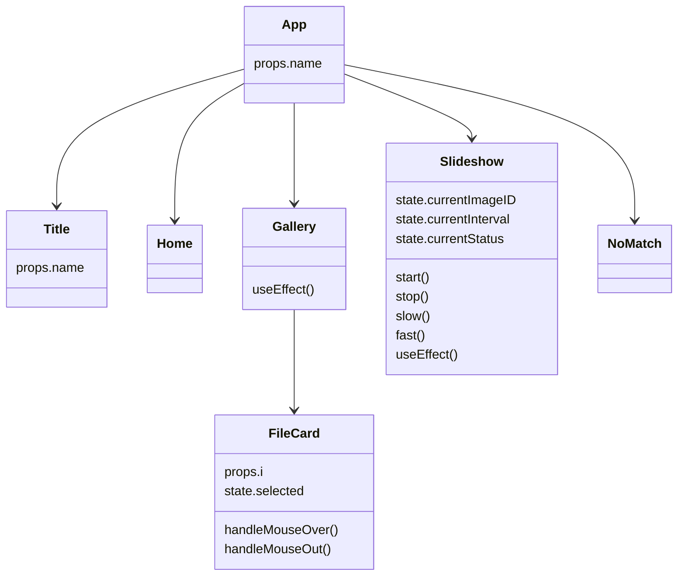

```mermaid
classDiagram
class App {props.name} 
App --> Title
App --> Home
App --> Gallery
App --> Slideshow
App --> NoMatch
class FileCard {props.i
state.selected
 handleMouseOver()
 handleMouseOut()}
Title : props.name
Gallery : useEffect()
Gallery --> FileCard
Slideshow : state.currentImageID
Slideshow : state.currentInterval
Slideshow : state.currentStatus
Slideshow : start()
Slideshow : stop()
Slideshow : slow()
Slideshow : fast()
Slideshow : useEffect()
```